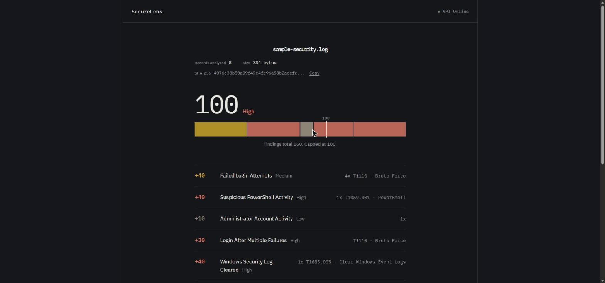
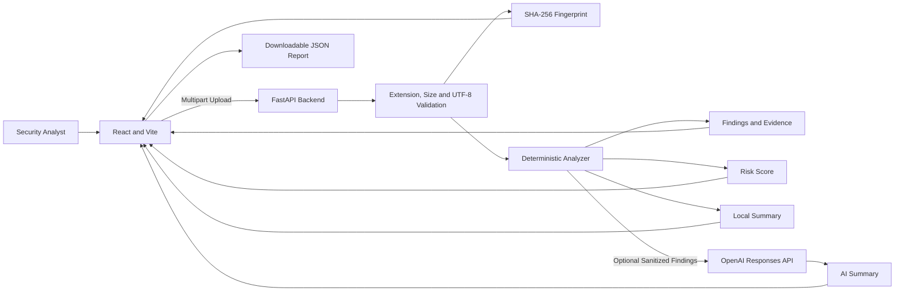

# SecureLens

[](https://github.com/jaysonnii/SecureLens/actions/workflows/backend-tests.yml)
[](https://github.com/jaysonnii/SecureLens/actions/workflows/frontend-checks.yml)

Upload a security log. Get back findings, the evidence behind each one, a risk score that shows its arithmetic, and MITRE ATT&CK mappings.

<!-- TODO: live demo link goes here, above the screenshot -->



A cybersecurity and software-engineering portfolio project. React, FastAPI, Python, Docker, GitHub Actions, with an optional OpenAI summary layer that is off by default.

---

## The part worth looking at

Most tools hand you a risk score and expect you to trust it. SecureLens shows how the number was built.

Every analysis returns the points each finding contributed, the reason for that contribution, the total before the 100-point cap, and the total after. Each finding carries the source lines it fired on, with line numbers, so a conclusion can be traced back to the log. If findings total more than 100, the response says so rather than quietly clamping.

That chain — score, contributions, evidence, ATT&CK technique — is the product.

## Two documents

These are the most useful things in the repo if you want to know how it was built rather than what it does.

**[SECURITY-REVIEW.md](SECURITY-REVIEW.md)** — an audit of this codebase: what was found, what was fixed, what is mitigated but still open, and what is accepted as low-severity risk with the reasoning. AI-assisted, findings verified empirically.

**[docs/rate-limiter-incident.md](docs/rate-limiter-incident.md)** — the review's headline finding, written up. The rate limiter was documented as rejecting requests before reading the upload body. It wasn't. Every functional test passed the whole time. An ASGI-level probe caught it.

## Architecture



The detection engine finds the evidence. The optional AI layer only explains evidence the deterministic analyzer already found; it never invents findings, and raw log content never reaches the prompt.

## What it detects

- Failed login attempts
- Successful login after multiple failures
- PowerShell execution
- Suspicious or encoded PowerShell activity
- Administrator or privileged account activity
- Windows security log clearing
- Account lockouts
- User account creation
- Privileged group membership changes
- Special privileges assigned to non-system logons
- Suspicious `mshta`, `certutil`, and `wmic` process execution

Recognized Windows Event IDs: `4625`, `4624`, `4104`, `1102`, `4740`, `4720`, `4728`, `4732`, `4672`, `4688`.

Login sequences are correlated by recognized username and source IPv4 address where available. Process-creation rules inspect command-line content to separate suspicious activity from benign Event ID `4688` records.

## Design decisions

Several things SecureLens doesn't do are deliberate, with reasoning worth stating.

**Nothing is stored.** No analysis history, no accounts, no authentication. For a public demo this is a security property, not a gap: there is no data at rest to leak and no auth surface to attack. It also means every analysis is ephemeral, which is a real limitation for actual investigation work.

**Uploads are validated before anything else runs.** Only `.txt`, `.log`, `.csv`, and `.json` are accepted; the file is read in bounded 64 KB chunks and rejected the instant it goes one byte past the configured limit, rather than after buffering the whole thing; content must decode as UTF-8. Uploads default to 5 MB, configurable 1 to 100. The low default is measured, not arbitrary: the login-correlation pass is worst-case quadratic, and a detection-dense log near 25 MB pinned a worker for about 200 seconds. A 5 MB dense log analyzes in roughly 10. Mitigated, not fixed — the algorithmic fix is tracked in [#35](https://github.com/jaysonnii/SecureLens/issues/35); see `SECURITY-REVIEW.md` Part 2, row 6.

**Analysis runs under a wall-clock budget** (`ANALYSIS_TIME_BUDGET_SECONDS`, default 40) so a request cannot outlive the reverse proxy's read timeout and leave a worker burning CPU behind a dropped connection. Over budget returns HTTP 413 rather than a timeout.

**AI is off by default and optional.** Only a restricted representation of deterministic findings reaches the OpenAI Responses API. Raw evidence lines and uploaded content are excluded by an explicit allowlist, not by filtering. Response storage is disabled. A failed or empty AI response falls back to the local summary rather than surfacing an error, and failure logs exclude API keys, prompts, raw log content, and exception messages.

**Timestamps are parsed narrowly or not at all.** Two formats are supported: ISO 8601, and the `/Date(milliseconds)/` form some PowerShell JSON exports produce. Bare `HH:MM:SS`, year-less syslog, locale-ambiguous `MM/DD/YYYY`, and bare epoch integers are deliberately unsupported, because each would require guessing. An unparseable value returns `null` rather than a plausible wrong answer. Where UTC was assumed rather than read, the response flags it. When at least two of a result's evidence events carry a timestamp, the frontend plots them on a timeline colored by severity, sharing selection state with the score bar and finding list — click a tick or a finding, and the other two follow. It reports how many events it could place ("4 of 7 events placed in time") rather than silently plotting only the parseable subset, and surfaces the same UTC-assumed caveat there. Fewer than two placed events, and the timeline doesn't render at all rather than imply a precision it doesn't have.

**Every accepted upload gets a SHA-256 fingerprint**, calculated from the original bytes and shown in full in the results. Downloaded JSON reports include the fingerprint and export timestamp but exclude the raw log preview.

**The backend runs as a non-root container user**, and local dev's CORS allowlist is limited to the Vite dev-server origins.

## Known limitations

- Detection is rule-based rather than a general parsing engine, and supported event formats are limited
- Source-address correlation recognizes IPv4 only
- Files must decode as UTF-8
- The per-IP rate limiter is a fixed window in a single process: it admits a brief 2x burst across a window boundary and does not share state across replicas. Accepted risk, not a gap — see `SECURITY-REVIEW.md` Part 1, F1-F2, for the reasoning
- Epoch timestamps in structured JSON/CSV time columns are recognized during parsing but not yet threaded through to evidence ([#38](https://github.com/jaysonnii/SecureLens/issues/38))
- Results require human review

Rules this limited will produce false positives and miss malicious activity.

## Try it

<details>
<summary><strong>Local setup</strong></summary>

Requires Python 3.14, Node.js 24, npm, Git. Docker optional.

**Backend**

```bash
cd backend
python -m venv venv
./venv/bin/python -m pip install --upgrade pip      # Windows: .\venv\Scripts\python.exe
./venv/bin/python -m pip install -r requirements.txt
cp .env.example .env                                 # Windows: Copy-Item .env.example .env
./venv/bin/python -m uvicorn main:app --reload
```

Backend on `http://127.0.0.1:8000`, API docs at `/docs`.

**Frontend** (second terminal, from the repo root)

```bash
npm --prefix frontend install                        # Windows: npm.cmd
cp frontend/.env.example frontend/.env
npm --prefix frontend run dev -- --port 5173
```

Frontend on `http://127.0.0.1:5173`.

**Then**

Upload `examples/sample-security.log` and click **Analyze log**. All data in the sample is fictional.

</details>

<details>
<summary><strong>Environment variables</strong></summary>

Create `backend/.env` from `backend/.env.example`.

| Variable | Default | Purpose |
|---|---|---|
| `MAX_FILE_SIZE_MB` | `5` | Upload limit, 1 to 100 MB |
| `ANALYSIS_TIME_BUDGET_SECONDS` | `40` | Wall-clock ceiling for one analysis; over budget returns HTTP 413 |
| `RATE_LIMIT_ENABLED` | `true` | Per-IP rate limiting on `POST /upload` |
| `RATE_LIMIT_MAX_REQUESTS` | `10` | Allowed uploads per IP per window |
| `RATE_LIMIT_WINDOW_SECONDS` | `60` | Length of the rate-limit window |
| `TRUST_PROXY_HEADERS` | `false` | Read the client IP from the proxy header; enable only behind the bundled nginx |
| `AI_SUMMARY_ENABLED` | `false` | Enables OpenAI summaries |
| `OPENAI_API_KEY` | empty | Used only when summaries are enabled |
| `OPENAI_MODEL` | `gpt-5-mini` | Model for the optional summary |
| `OPENAI_TIMEOUT_SECONDS` | `12` | Per-call ceiling; on timeout the local summary is used |

Frontend: `frontend/.env` from the example, with `VITE_API_URL=http://127.0.0.1:8000`.

Never commit a real API key.

</details>

<details>
<summary><strong>Docker</strong></summary>

```bash
docker compose up -d --build --wait --wait-timeout 90
docker compose ps
```

The frontend publishes no host port. nginx is reachable only from inside the `securelens` Docker network, by design. To reach a running stack:

- **Behind Cloudflare Tunnel** (the deployed setup): set `CLOUDFLARE_TUNNEL_TOKEN` and start the sidecar with `docker compose --profile cloudflare-tunnel up -d --build --wait`
- **Local checks without a tunnel**: attach a throwaway container to the same network, e.g. `docker run --rm --network securelens_securelens curlimages/curl -s http://frontend:80/api/health`
- **Browsing the UI locally**: use the dev setup above. The Compose stack mirrors production topology rather than being meant for direct browsing.

`docker compose down` to stop. See [DEPLOYMENT.md](DEPLOYMENT.md) for production configuration.

</details>

<details>
<summary><strong>API and testing</strong></summary>

**Endpoints:** `GET /health`, `POST /upload`

Upload takes `multipart/form-data` with a field named `file`.

```bash
curl -F "file=@examples/sample-security.log" http://127.0.0.1:8000/upload
```

**Response shape.** Each finding carries type, severity, detection count, ATT&CK mapping, up to three evidence entries, and a recommended action. Each evidence entry is `{line_number, text, timestamp}`: the 1-indexed source line, the matched text (deduped by normalized content, truncated to 240 characters), and either `null` or `{original, utc, timezone_assumed}`. Where identical lines were deduped, the line number is the first occurrence. The response also includes `analysis_duration_seconds`, measured with a monotonic clock around the detection engine only.

**Tests**

```bash
./backend/venv/bin/python -m pytest                   # Windows: .\backend\venv\Scripts\python.exe -m pytest
npm --prefix frontend run test                        # Windows: npm.cmd
npm --prefix frontend run lint                         # Windows: npm.cmd
npm --prefix frontend run build                        # Windows: npm.cmd
```

Pytest, Vitest with React Testing Library, ESLint, and a production build check. GitHub Actions runs all of it on pushes and pull requests to `main`.

</details>

## Stack

**Frontend** React, Vite, JavaScript, CSS, Vitest, React Testing Library, ESLint

**Backend** Python, FastAPI, Uvicorn, OpenAI Python SDK, Pytest, python-multipart, python-dotenv

**Infrastructure** Docker, nginx, Cloudflare Tunnel, GitHub Actions

## Roadmap

The next real milestone is multi-file correlation: several scattered logs becoming one chronological, evidence-backed incident story. That depends on normalizing events before detection runs, which is also what [#35](https://github.com/jaysonnii/SecureLens/issues/35) and [#38](https://github.com/jaysonnii/SecureLens/issues/38) are waiting on.

Beyond that: additional Windows and Linux detections, IPv6 correlation, saved investigations with analyst notes, PDF case reports, configurable detection rules.

## Disclaimer

SecureLens is an educational project. It is not a replacement for a SIEM, an EDR platform, an incident-response process, or a trained analyst. Do not use it as the sole basis for incident-response, legal, compliance, or production-security decisions. Avoid uploading credentials, secrets, regulated data, or sensitive production logs to an untrusted deployment.

## Author

Built by [Jay Soni](https://github.com/jaysonnii).
