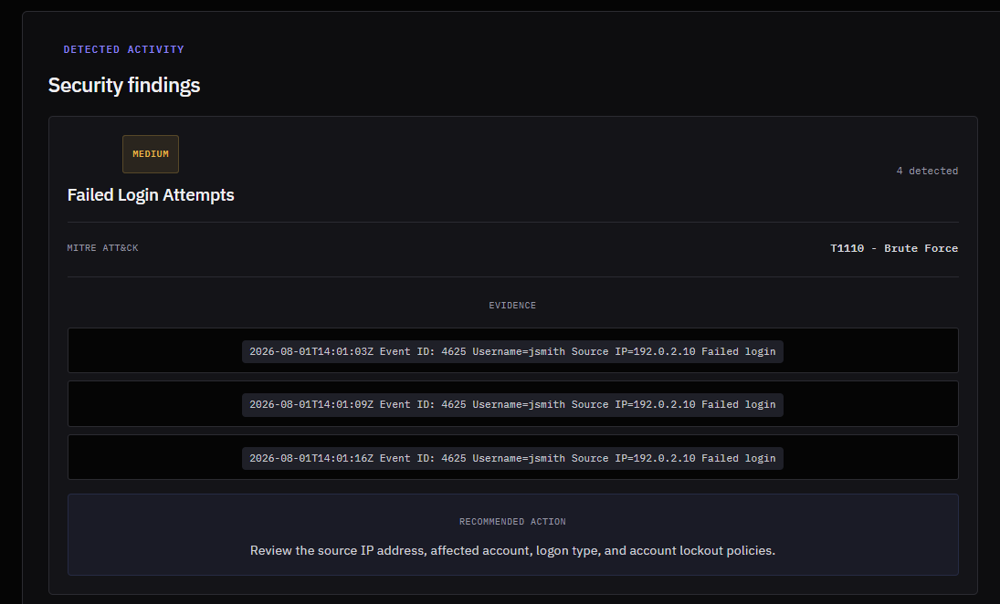
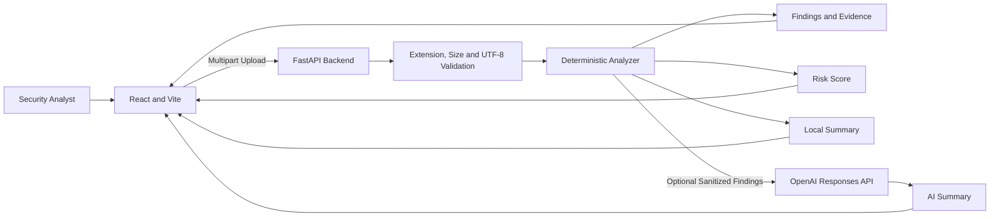

# SecureLens

[](https://github.com/jaysonnii/SecureLens/actions/workflows/backend-tests.yml)
[](https://github.com/jaysonnii/SecureLens/actions/workflows/frontend-checks.yml)

SecureLens is an AI-assisted security log analysis application that turns raw log files into readable findings, evidence, risk scores, MITRE ATT&CK mappings, and recommended investigation steps.

It is a hands-on cybersecurity and software-development portfolio project built with React, FastAPI, Python, Docker, OpenAI, and GitHub Actions.



## What SecureLens Does

Users can upload a supported security log and receive:

- Detected security findings
- Severity and supporting evidence
- A transparent risk score from 0 to 100
- MITRE ATT&CK mappings
- Recommended investigation steps
- A local analyst-style summary
- An optional OpenAI-generated summary

SecureLens is an educational analysis tool. It is not a replacement for a SIEM, EDR platform, incident-response process, or trained security analyst.

## Current Detection Rules

The deterministic analyzer currently detects:

- Failed login attempts
- Successful login after multiple failures
- PowerShell execution
- Suspicious or encoded PowerShell activity
- Administrator or privileged account activity
- Windows security log clearing

Recognized Windows Event IDs include `4625`, `4624`, `4104`, and `1102`.

Login sequences are correlated using recognized usernames and source IPv4 addresses when available.

## Key Features

### Secure Upload Validation

- Accepts `.txt`, `.log`, `.csv`, and `.json`
- Requires UTF-8 text
- Enforces a 5 MB limit
- Reads uploads in bounded 64 KB chunks
- Rejects oversized files after the first byte beyond the limit

### Explainable Risk Scoring

SecureLens returns the points added by each finding, the reason for each score contribution, the score before the cap, the final score after the 100-point cap, and a Low, Medium, or High risk level.

### Evidence-Focused Findings

Each finding can include its type, severity, detection count, MITRE ATT&CK mapping, up to three evidence lines, and a recommended analyst action.

### Optional AI Summary

AI summaries are disabled by default. When enabled, SecureLens sends only a restricted representation of deterministic findings to the OpenAI Responses API. Raw evidence lines and uploaded log content are excluded from the AI input.

When the AI request fails or returns an empty result, SecureLens safely falls back to a local summary.

### Automated Testing

The project includes backend tests with Pytest, frontend workflow tests with Vitest and React Testing Library, ESLint, production-build checks, and GitHub Actions.

## Architecture



## Technology Stack

**Frontend:** React, Vite, JavaScript, CSS, Vitest, React Testing Library, ESLint

**Backend:** Python, FastAPI, Uvicorn, OpenAI Python SDK, Pytest, python-multipart, python-dotenv

**DevOps:** Docker and GitHub Actions

## Project Structure

```text
SecureLens/
├── .github/workflows/
├── backend/
│   ├── app/routers/
│   ├── app/services/
│   ├── tests/
│   ├── .env.example
│   └── Dockerfile
├── docs/images/
├── examples/sample-security.log
├── frontend/
│   ├── src/
│   ├── .env.example
│   └── vitest.config.js
├── pytest.ini
└── README.md
```

## Requirements

- Python 3.14
- Node.js 24
- npm
- Git
- Docker, optional

## Local Setup

### Backend on Windows

```powershell
cd backend
python -m venv venv
.\venv\Scripts\python.exe -m pip install --upgrade pip
.\venv\Scripts\python.exe -m pip install -r requirements.txt
Copy-Item .env.example .env
.\venv\Scripts\python.exe -m uvicorn main:app --reload
```

Backend: `http://127.0.0.1:8000`

API documentation: `http://127.0.0.1:8000/docs`

### Frontend on Windows

Open another terminal from the repository root:

```powershell
npm.cmd --prefix frontend install
Copy-Item frontend\.env.example frontend\.env
npm.cmd --prefix frontend run dev -- --port 5173
```

Frontend: `http://127.0.0.1:5173`

## Environment Variables

### Backend

Create `backend/.env` from `backend/.env.example`.

| Variable | Default | Purpose |
|---|---|---|
| `AI_SUMMARY_ENABLED` | `false` | Enables or disables OpenAI summaries |
| `OPENAI_API_KEY` | Empty | API key used only when summaries are enabled |
| `OPENAI_MODEL` | `gpt-5-mini` | Model used for the optional summary |

Never commit a real API key.

### Frontend

Create `frontend/.env` from `frontend/.env.example`.

```env
VITE_API_URL=http://127.0.0.1:8000
```

## Try the Included Sample

1. Start the backend and frontend.
2. Open `http://127.0.0.1:5173`.
3. Upload `examples/sample-security.log`.
4. Click **Analyze log**.
5. Review the score breakdown, evidence, MITRE mappings, summary, and recommended actions.

All data in the sample is fictional.

## API Endpoints

- `GET /health`
- `POST /upload`

The upload request must use `multipart/form-data` with a field named `file`.

PowerShell example:

```powershell
curl.exe -F "file=@examples/sample-security.log" http://127.0.0.1:8000/upload
```

## Docker

```powershell
docker build -t securelens-backend ./backend
docker run --rm -p 8000:8000 securelens-backend
```

With environment variables:

```powershell
docker run --rm -p 8000:8000 --env-file backend/.env securelens-backend
```

## Deployment

See [DEPLOYMENT.md](DEPLOYMENT.md) for the full-stack Docker Compose deployment and production configuration.

## Testing

```powershell
.\backend\venv\Scripts\python.exe -m pytest
npm.cmd --prefix frontend run test
npm.cmd --prefix frontend run lint
npm.cmd --prefix frontend run build
```

GitHub Actions runs backend and frontend checks for pushes and pull requests targeting `main`.

## Security and Privacy Design

- Uploads are limited to 5 MB.
- Oversized uploads are read only to the limit plus one byte.
- Only supported text extensions are accepted.
- Files must decode as UTF-8.
- Raw evidence and uploaded log content are excluded from AI prompts.
- OpenAI response storage is disabled.
- AI failures fall back to local summaries.
- AI failure logs exclude API keys, prompts, raw logs, and exception messages.
- The backend Docker container runs as a non-root user.
- Local CORS access is limited to the Vite development origins.

Avoid uploading credentials, secrets, regulated data, or sensitive production logs to an untrusted deployment.

## Current Limitations

- Detection is rule-based rather than a complete parsing engine.
- Supported event formats are limited.
- Source-address correlation currently recognizes IPv4 only.
- Files must contain UTF-8 text.
- Analysis history is not stored.
- There is no authentication or account system.
- The app is primarily configured for local development.
- The frontend is not yet containerized.
- AI summaries require an external OpenAI request when enabled.
- Results require human review.

## Roadmap

- Additional Windows and Linux detections
- IPv6 identity correlation
- Structured JSON and CSV parsing
- Authentication and role-based access
- Saved analysis history
- Exportable reports
- SIEM and ticketing integrations
- Production deployment configuration
- Configurable detection rules
- Frontend containerization
- Expanded browser and accessibility testing

## Disclaimer

SecureLens is an educational cybersecurity project. Its limited rules may produce false positives or miss malicious activity. Do not use it as the sole basis for incident-response, legal, compliance, or production-security decisions.

## Author

Built by [Jay Soni](https://github.com/jaysonnii) as a hands-on cybersecurity and software-development portfolio project.
